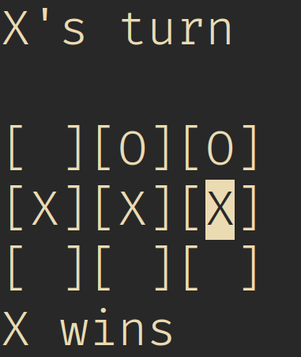

# ygttt

a simple tic tac toe game written in fortran 2003 using ncurses



## build
first clone the repository

```
git clone https://github.com/yeti0904/ygttt --recurse-submodules
```

then build M_ncurses

```
cd M_ncurses/src
make F90=gfortran gfortran
```

then build ygttt

```
cd ../..
make
```

## controls
arrow keys to move cursor

space key to place an X or O